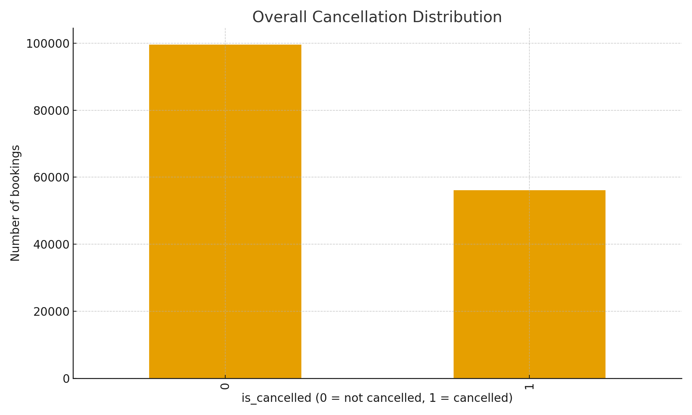
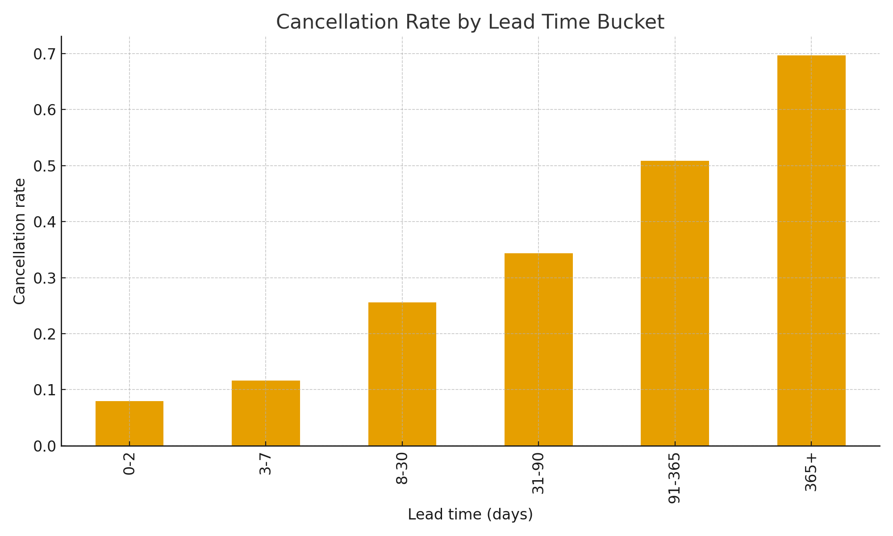
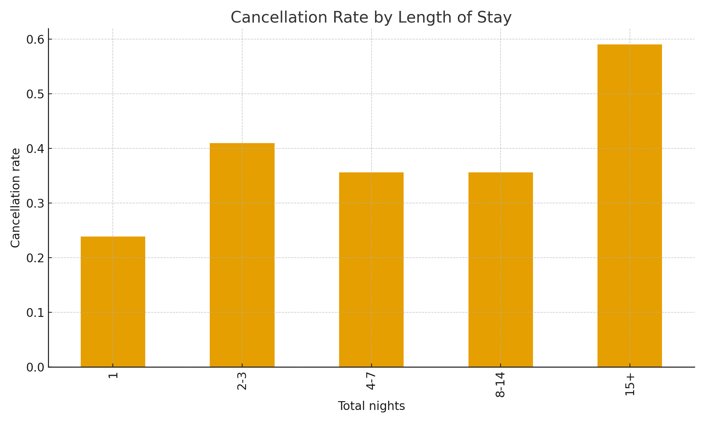
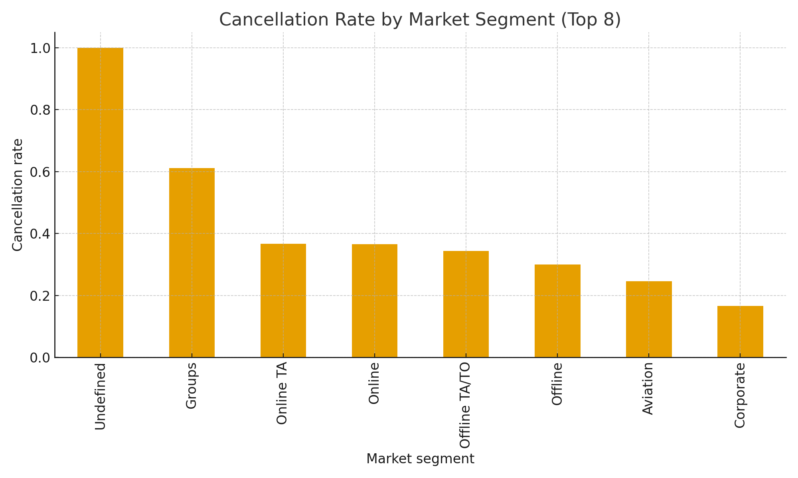

# Hotel Booking Cancellation Prediction Model

End-to-end machine learning project for predicting hotel booking cancellations.

This repository contains:

- Data pipelines to build a unified **master dataset** from multiple booking sources
- Feature engineering for hotel bookings (lead time, stay pattern, guest stats, segment behaviour)
- A scikit-learn model pipeline with preprocessing + RandomForest classifier
- Batch scoring + REST API for online predictions
- Config + logging so the project behaves like a real internal ML service

> NOTE: Raw datasets are **not** committed to Git. You can plug in your own data
> following the same schema and folder structure.

---

## 1. Problem Statement

Hotels face significant revenue risk due to **late cancellations** and **no-shows**.

The goal of this project is to:

1. Predict the **probability that a booking will be cancelled**.
2. Expose this as:
   - A batch scoring process (for BI / risk dashboards)
   - A REST API (`/predict_raw`) that takes a **single booking JSON** and returns:
     - `cancellation_probability`
     - binary label (`predicted_label`: cancel / not cancel)
     - `risk_bucket` (low/medium/high)

This can be used to:

- Adjust overbooking strategies
- Prioritize **high-risk bookings** for manual confirmation
- Design CLM / messaging flows based on risk buckets

---

## 2. Data Sources

The model is trained on **three datasets** under `data/raw/`:

1. **`hotel_booking.csv`** – classic hotel booking dataset (Kaggle-style) with:
   - `hotel`, `is_canceled`, `lead_time`
   - `arrival_date_year`, `arrival_date_month`, `arrival_date_week_number`, `arrival_date_day_of_month`
   - `stays_in_weekend_nights`, `stays_in_week_nights`
   - `adults`, `children`, `babies`
   - `meal`, `country`, `market_segment`, `distribution_channel`
   - `is_repeated_guest`
   - `previous_cancellations`, `previous_bookings_not_canceled`
   - `reserved_room_type`, `assigned_room_type`
   - `booking_changes`, `deposit_type`, `agent`, `company`
   - `days_in_waiting_list`, `customer_type`
   - `adr`, `required_car_parking_spaces`, `total_of_special_requests`
   - `reservation_status`, `reservation_status_date`

2. **`updated_hotel_data.csv`** – enrichment keyed by `index`, providing:
   - `cancellation_rate_by_month`
   - `cancellation_rate_by_leadtime`
   - `cancellation_rate_by_deposit`
   - plus `total_bookings` and `total_cancellations` variants

3. **`booking.csv`** – custom booking dataset with:
   - `Booking_ID`, `booking status`
   - `number of adults`, `number of children`
   - `number of weekend nights`, `number of week nights`
   - `type of meal`
   - `car parking space`
   - `room type`
   - `lead time`
   - `market segment type`
   - `repeated`
   - `P-C`, `P-not-C`
   - `average price`
   - `special requests`
   - `date of reservation`

### Unified label

Across all sources, we define a single label:

- **`is_cancelled`** (0 = not cancelled, 1 = cancelled)
  - For hotel_booking: `is_cancelled = is_canceled`
  - For booking.csv: `is_cancelled = 1` if `booking status == 'Canceled'`, else `0`

---

## 3. Data Pipeline & Master Dataset

Script: **`scripts/build_master_dataset.py`**

Steps:

1. Load all three raw CSVs from `data/raw/`.
2. Deduplicate `updated_hotel_data.csv` by `index` and join onto `hotel_booking.csv`.
3. Normalize labels to `is_cancelled` in both families of data.
4. Add a `source_dataset` flag to track origin.
5. Derive additional booking features (see next section).
6. Append enriched Kaggle data + booking.csv rows.
7. Filter to rows where `is_cancelled` is not null.
8. Save final combined file:

   ```text
   data/processed/master_bookings.csv
   ```

Result: ~155k bookings and 100+ columns in a single master file.

---

## 4. Feature Engineering

### 4.1 Raw features (Kaggle-style)

- `lead_time`, `arrival_date_*`
- `stays_in_weekend_nights`, `stays_in_week_nights`
- `adults`, `children`, `babies`
- `meal`, `country`, `market_segment`, `distribution_channel`
- `is_repeated_guest`
- `previous_cancellations`, `previous_bookings_not_canceled`
- `reserved_room_type`, `assigned_room_type`
- `booking_changes`, `deposit_type`
- `days_in_waiting_list`, `customer_type`
- `adr`, `required_car_parking_spaces`, `total_of_special_requests`

### 4.2 Raw features (booking.csv)

- `lead time`, `market segment type`
- `number of weekend nights`, `number of week nights`
- `number of adults`, `number of children`
- `type of meal`, `room type`
- `car parking space`, `repeated`
- `average price`, `special requests`

### 4.3 Aggregate risk features (updated_hotel_data)

- `cancellation_rate_by_deposit`
- `cancellation_rate_by_leadtime`
- `cancellation_rate_by_month`
- associated `total_bookings` and `total_cancellations` measures

### 4.4 Derived booking-time features

For Kaggle-style data:

- `total_nights = stays_in_weekend_nights + stays_in_week_nights`
- `total_guests = adults + children + babies`
- `adr_per_guest = adr / max(total_guests, 1)`
- `is_short_lead = 1 if lead_time <= 2 else 0`
- `is_long_stay = 1 if total_nights >= 7 else 0`
- `is_family = 1 if (children > 0 or total_guests >= 3) else 0`

For booking.csv data:

- `total_nights = number of weekend nights + number of week nights`
- `total_guests = number of adults + number of children`
- `adr_per_guest = average price / max(total_guests, 1)`

### 4.5 Leakage prevention

We do **not** use:

- PII: `Booking_ID`, `name`, `email`, `phone-number`, `credit_card`
- Outcome-like fields: `is_canceled`, `is_canceled_upd`, `booking status`
- Post-outcome fields: `reservation_status`, `reservation_status_date`

Only booking-time-safe features + historical aggregates are used.

---

## 5. Exploratory Insights (Graphs)

The following plots are generated from the combined dataset and saved under
`hotel_readme_images/`.

### 5.1 Overall cancellation distribution

File: `hotel_readme_images/cancellation_distribution.png`

Shows 0 vs 1 counts for `is_cancelled` (class balance).

### 5.2 Cancellation rate by lead time

File: `hotel_readme_images/cancellation_by_lead_time.png`

Lead time buckets:

- `0-2`, `3-7`, `8-30`, `31-90`, `91-365`, `365+` days

### 5.3 Cancellation rate by length of stay

File: `hotel_readme_images/cancellation_by_nights.png`

Length-of-stay buckets:

- `1`, `2-3`, `4-7`, `8-14`, `15+` nights

### 5.4 Cancellation rate by market segment

File: `hotel_readme_images/cancellation_by_market_segment.png`

Top 8 market segments ranked by cancellation rate.

These graphs can be referenced directly in the GitHub README as:

```markdown




```

---

## 6. Model Architecture

Implemented in `src/hcp_model/modeling.py` as a scikit-learn `Pipeline`:

```text
[Raw DataFrame] → [ColumnTransformer(preprocess)] → [RandomForestClassifier]
```

### 6.1 Preprocessing

- Numeric columns:
  - `SimpleImputer(strategy="median")`
  - `StandardScaler`
- Categorical columns:
  - `SimpleImputer(strategy="most_frequent")`
  - `OneHotEncoder(handle_unknown="ignore", sparse_output=False)`

### 6.2 Classifier (RandomForest)

Configured via `config/config.yaml` (simplified):

```yaml
model:
  rf:
    n_estimators: 200
    max_depth: null
    min_samples_split: 2
    min_samples_leaf: 1
```

Logistic Regression is also trained as a baseline, but RandomForest is used as
the main production model.

---

## 7. Training, Evaluation & Scoring

### 7.1 Training (scripts/train_baseline.py)

1. Load `data/processed/master_bookings.csv`.
2. Split into train/test (`test_size=0.3`).
3. Train Logistic Regression and RandomForest.
4. Evaluate using Accuracy, F1, ROC AUC, and full classification report.
5. Select the best model by ROC AUC and save to:

   ```text
   models/baseline_model.joblib
   ```

### 7.2 Typical metrics (RandomForest)

On a held-out test set (approx 30% of data):

- Accuracy: ~0.88–0.89
- F1 (macro): ~0.83
- ROC AUC: ~0.95

On the full dataset (for reference only):

- Accuracy: ~0.94
- ROC AUC: ~0.98

### 7.3 Batch scoring (scripts/batch_score.py)

1. Load `models/baseline_model.joblib`.
2. Load `data/processed/master_bookings.csv`.
3. Predict for each row:
   - `pred_cancellation_proba`
   - `pred_label`
   - `risk_bucket`
4. Save to:

   ```text
   data/processed/master_bookings_scored.csv
   ```

---

## 8. REST API

Defined in `src/hcp_model/api.py` using FastAPI.

### Endpoints

- `GET /health` – simple JSON health check.

- `POST /predict_raw` – takes a raw booking JSON and returns:

  ```json
  {
    "booking_id": "BKG-NEW-001",
    "cancellation_probability": 0.72,
    "predicted_label": 1,
    "risk_bucket": "high"
  }
  ```

Internally, `predict_raw`:

1. Parses the raw JSON.
2. Applies the same feature engineering used at training time.
3. Runs the RandomForest model.

### Run locally

```bash
source .venv/bin/activate
PYTHONPATH=src uvicorn hcp_model.api:app --reload
```

Swagger UI will be available at `http://127.0.0.1:8000/docs`.

---

## 9. Project Structure

```text
hotel-cancellation-model/
├── config/
│   └── config.yaml
├── data/
│   ├── raw/
│   └── processed/
├── models/
├── scripts/
│   ├── build_master_dataset.py
│   ├── train_baseline.py
│   ├── batch_score.py
│   └── tune_random_forest.py    # optional hyperparam tuning
├── src/
│   └── hcp_model/
│       ├── __init__.py
│       ├── config.py
│       ├── logging_utils.py
│       ├── data_loader.py
│       ├── features.py
│       ├── modeling.py
│       ├── scoring.py
│       └── api.py
├── hotel_readme_images/
│   ├── cancellation_distribution.png
│   ├── cancellation_by_lead_time.png
│   ├── cancellation_by_nights.png
│   └── cancellation_by_market_segment.png
└── README.md
```
